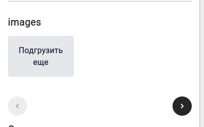
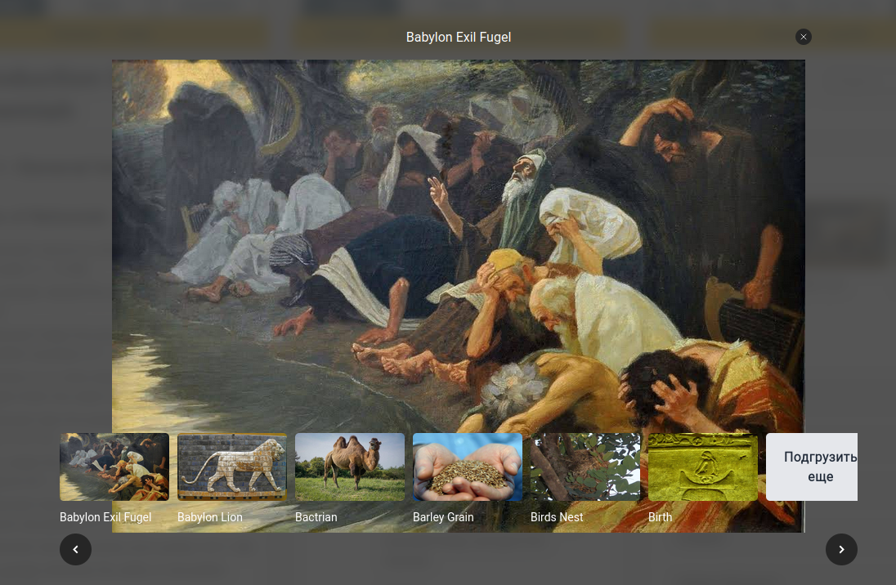

РАБОТА С КАРТИНКАМИ
1. Когда пустой массив - то кнопки навигации ведут непредсказуемо себя. Тут к примеру можно листать вправо. Я бы их либо убирал, либо делал неактивными.

2. Опустить карусель миниатюр ниже большой картинки.

3. Кнопку с крестиком побольше, также как кнопки навигации
4. Кнопку "подгрузить ещё" - сделать явно видно, когда она неактивна - убрать ховер и может бледней
5. Проверить на разных размерах экрана большую карусель.
6. Проверить на разных размерах экрана малую карусель.
7. проверить все переводы и перевести, если нужно
8. Запоминать позицию скролла - если останется время. Когда много элементов в словаре , открывается контент, а потом возвращается - скроллится в начало.
9. Добавить в девелоп базе в первые 2 шага
10. Добавить в мастре базу в первые 2 шага
11. Брать language_code c основного ресурса literal
